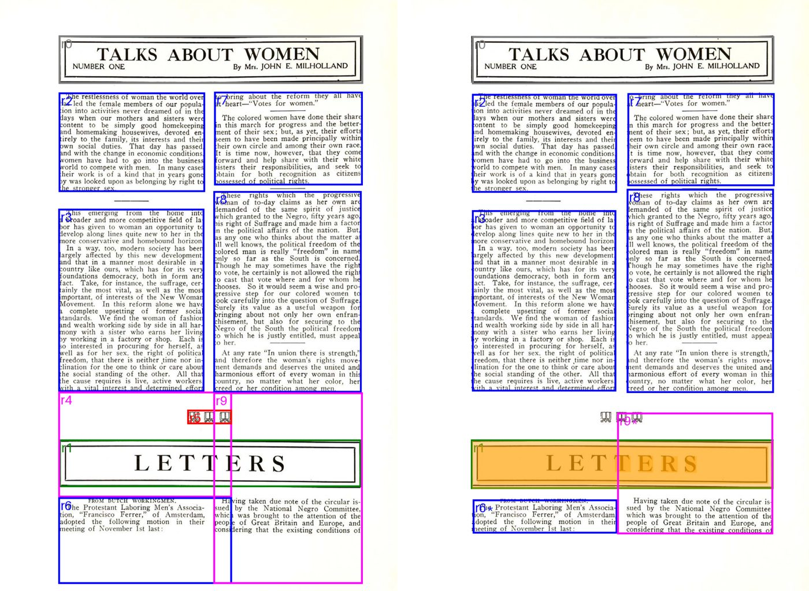
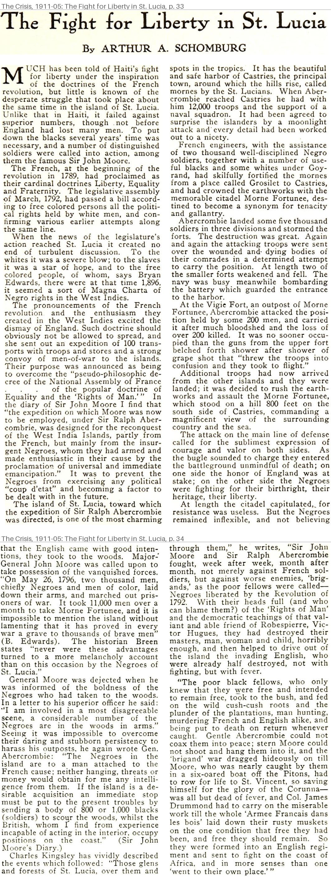

# The Crisis Archive

*The Crisis: A Record of the Darker Races* (NAACP, ed. W. E. B. Du Bois), 148 issues,
November 1910 to December 1922, built with [paperpress](https://github.com/nealcaren/paperpress).

**Source.** Scans are from the [Modernist Journals Project](https://modjourn.org/journal/crisis/)
via the Brown Digital Repository (rights: No Copyright - United States). Each issue's
`issue.json` links back to its MJP page and Brown PDF.

**OCR.** DocLayout-YOLO + GLM-OCR (newspaper-ocr 0.10.0), using a local MLX server:

    mlx_vlm.server --host 127.0.0.1 --port 8080 --model mlx-community/GLM-OCR-bf16
    paperpress ocr crisis

**Rebuilding from scratch.**

    python3 scripts/fetch_mjp.py            # PDFs -> /Volumes/Lightning/crisis-pdfs, manifest -> pdfs/
    paperpress add pdf crisis /Volumes/Lightning/crisis-pdfs
    python3 scripts/apply_mjp_metadata.py   # month precision, volume/number, source links

The Crisis is monthly, so PDFs are named `YYYY-MM-01` and then marked month precision.

**Corrections to MJP metadata** (in `scripts/fetch_mjp.py`, `OVERRIDES`):

| Brown id | MJP date | Used | Why |
|---|---|---|---|
| bdr:522172 | 1912-06 | 1911-06 | Vol. 2, No. 2 is June 1911 |
| bdr:509928 | 1916-06 | 1916-05 | Vol. 12, No. 1 is May 1916 |
| bdr:510193 | 1916-07 | 1916-07 supplement | "The Waco Horror" supplement (8 pp.) |
| bdr:510907 | 1917-05 | 1917-07 supplement | Memphis supplement, printed "July, 1917, Vol. 14, No. 3" (4 pp.) |

**Status.** All 148 issues are imported. OCR is done for November 1910 through July 1911
(9 issues, 332 pages); the rest is paused.

## Articles: cleaned boxes, voted tables of contents, clips

Prototype scripts for getting each article's full text and an image of just that
article. They're meant to move upstream (`upstream/` has the drafted issues).

    scripts/run_chain.sh 1911-01-01 ...     # all three steps for OCR'd issues

1. **`clean_boxes.py`** rewrites each page's OCR regions so every glyph belongs to exactly
   one region: overlaps resolved at column gutters, clipped letters recovered,
   hallucinated reads dropped, changed regions re-read with GLM-OCR (with a guard against
   lost words), and regions split where a heading starts a new article inside them.
   Writes `page_NN.clean.json` beside the untouched `page_NN.json`.
2. **`paperpress enrich`** run three times on the cleaned regions, guided by the layout
   notes in `titles/crisis/profile.json`, and **`toc_vote.py`** combines the runs into
   `toc.voted.json`, with a `vote_agreement` score for each article. (Each issue's
   `toc.json` is an earlier single run on the raw regions.)
3. **`clip_article.py`** writes an article's text and a PNG of only its regions:

       python scripts/clip_article.py 1911-05-01 "st. lucia" --toc titles/crisis/1911-05-01/toc.voted.json

| Before / after cleanup | Clip from the voted contents |
|---|---|
|  |  |

`draw_boxes.py` draws before/after overlays; `box_audit.py` counts overlaps and junk.

Not in git: PDFs (on the external drive), page images (`titles/*/*/images/`), caches, `site/`,
and `boxwork/` (scratch output).
